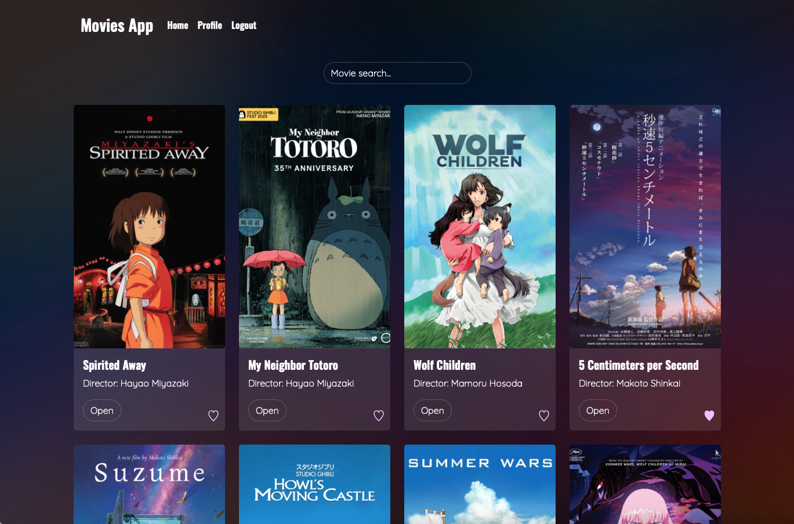
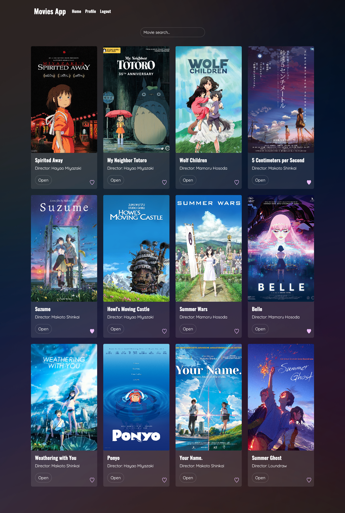
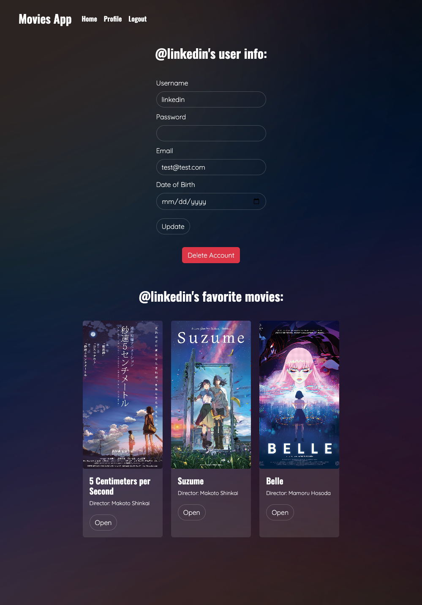

# myFlix React app

## Demo
The deployed app can be viewed here: https://sw-movieapp.netlify.app/

## Objective of project
Using React, build the client-side for an app called myFlix based on its existing server-side code (REST API and database). 

### Tech
* JavaScript
* React
* Bootstrap
* Parcel
* Application uses state routing to navigate between views and share URLs

## Images of app: 

### Full main view:

### Full profile view:

